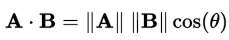
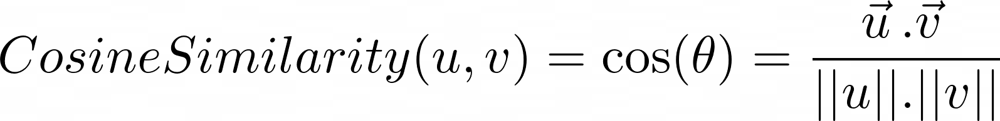
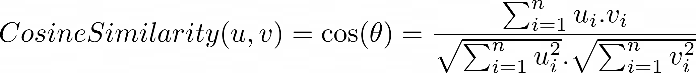

# Text Similarity Metrics

In this post we will discuss and implement some methods for calculating text similarity.

We will start with very well known method called Cosine Similarity method.

## Cosine Similarity
It is a metric used to measure how similar the text documents are. The inception behind this method comes from the math and the measurement of the cosine angle between two vectors after projection in multi dimensional space.


<p align="center">
  
</p>

In the following example we assume that the two vectors represents two sentences. 
If the two vectors are close to parallel, we can say that the two sentences are similar. But if the two vectors are orthogonal, we will that these two sentences are NOT similar.
<br/>
In cosine similarity the smaller the angle the higher the similarity.
<br/>
Mathematically
<br/>
<p align="center">
  
</p>

<p align="center">
  
</p>

<p align="center">
  
</p>

## Python code
<br/>
In this example we will use lemmatization in order to get better results.
<br/>
With lemmatization  we can reduce same words from same root example : 'has' and 'have' will become a same word.

<br/>


```python
count_vectorizer = CountVectorizer(strip_accents = 'unicode',
                       stop_words = 'english')
sparse_matrix = count_vectorizer.fit_transform(documents)

# OPTIONAL: Convert Sparse Matrix to Pandas Dataframe if you want to see the word frequencies.
doc_term_matrix = sparse_matrix.todense()
df = pd.DataFrame(doc_term_matrix, 
                  columns=count_vectorizer.get_feature_names())
```


You can see the full example under /code folder in the main rep.
