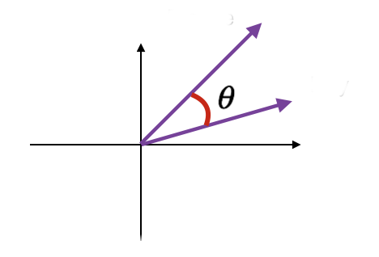

# Text Similarity Metrics

In this post we will discuss and implement some methods for calculating text similarity.

We will start with very well known method called Cosine Similarity method.

## Cosine Similarity
It is a metric used to measure how similar the text documents are. The inception behind this method comes from the math and the measurement of the cosine angle between two vectors after projection in multi dimensional space.

  

In the following example we assume that the two vectors represents two sentences. 
If the two vector are close to parallel, we can say that the two sentences are similar. But if the two vectors are orthogonal, we will that these two sentences are NOT similar.
